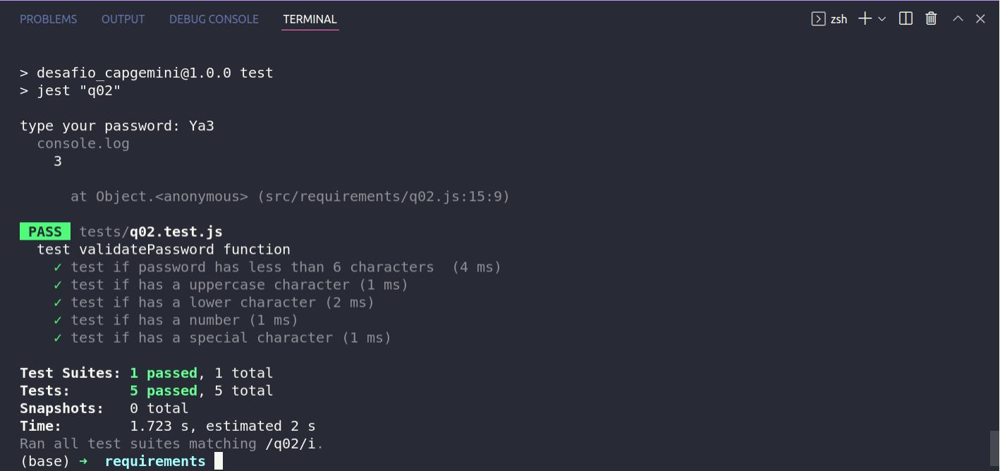
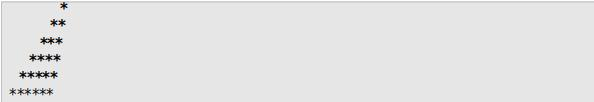

# DESAFIO DE PROGRAMAÇÃO - ACADEMIA CAPGEMINI

---

# Sumário
- [Pre-requisitos](#pre-requisitos)
- [Habilidades](#habilidades)
- [Instruções de como rodar as aplicações](#instruções)
- [Testes](#instruções)
- [Requisitos do projeto](#requisitos-do-projeto)
  - [1 - Escreva um algoritmo que mostra na tela uma escada de tamanho n.](##questão1)
  - [2 - Construa um algoritmo para verificar a segurança da senha.](##questão2)
  - [3 - Desenvolva um que enconrte o número de pares de substrings que são anagramas.](##questão3)

---
# Pre-requisitos:
  - NPM
---
# Habilidades

- Resolver os requisitos propostos na linguagem JavaScript;
- Usar o prompt para usar o input do usuário digitado no console;
- Teste unitários com o Jest;
- Linter para fazer a análise estática do código;
---
# Instuções

1. Clone o repositório
- `git clone repositório`
- Entre na pasta do repositório que você acabou de clonar:
- `cd repositório`
2. Instalar as dependências
- `npm install`
3. Entre na pasta com os requisitos:
- `cd src/requirements`
4. Rode os requisitos no modelo: node requisito (q01, q02 ou q03). Por exemplo:
- `node q01`

---
# Testes
- Os testes foram realizados com Jest
- Para testar algum requisito, digite npm run requisito (q01, q02 ou q03) e depois apertar enter quando surgir o input. Por exemplo:
- `npm run test q02`

---
# Requisitos do Projeto

## Questão 1

Escreva um algoritmo que mostre na tela uma escada de tamanho n utilizando o caractere * e espaços. A base e altura da escada devem ser iguais ao valor de n. A última linha não deve conter nenhum espaço.

#### Exemplo:
Entrada:

`n = 6`

Saída:

## Questão 2

Débora se inscreveu em uma rede social para se manter em contato com seus amigos. A página de cadastro exigia o preenchimento dos campos de nome e senha, porém a senha precisa ser forte. O site considera uma senha forte quando ela satisfaz os seguintes critérios:
  - Possui no mínimo 6 caracteres.
  - Contém no mínimo 1 digito.
  - Contém no mínimo 1 letra em minúsculo.
  - Contém no mínimo 1 letra em maiúsculo.
  - Contém no mínimo 1 caractere especial. Os caracteres especiais são: !@#$%^&*()-+

Débora digitou uma string aleatória no campo de senha, porém ela não tem certeza se é uma senha forte. Para ajudar Débora, construa um algoritmo que informe qual é o número mínimo de caracteres que devem ser adicionados para uma string qualquer ser considerada segura.

#### Exemplo:
Entrada:
`Ya3`

Saída:
`3`

#### Explicação:
Ela pode tornar a senha segura adicionando 3 caracteres, por exemplo, &ab, transformando a senha em Ya3&ab. 2 caracteres não são suficientes visto que a senha precisa ter um tamanho mínimo de 6 caracteres.

## Questão 3

Duas palavras podem ser consideradas anagramas de si mesmas se as letras de uma palavra podem ser realocadas para formar a outra palavra. Dada uma string qualquer, desenvolva um algoritmo que encontre o número de pares de substrings que são anagramas.

#### Exemplos:
- Exemplo 1:
  Entrada:
  `ovo`
  Saída:
  `2`

Explicaçao: A lista de todos os anagramas pares são: [o, o], [ov, vo]. 

- Exemplo 2:
  Entrada:
  `ifailuhkqq`
  Saída:
  `3`

Explicaçao: A lista de todos os anagramas pares são: [i, i], [q, q] e [ifa, fai].

---

## Contatos:

  

    <h4> Rodrigo de A. Queiroz </h4>
  

      https://www.linkedin.com/in/rodrigoandradequeiroz/
  

   
  

     https://github.com/rodrigoaqueiroz
  

   
  

    </img>
    rodrigoandradequeiroz@gmail.com
  

 

